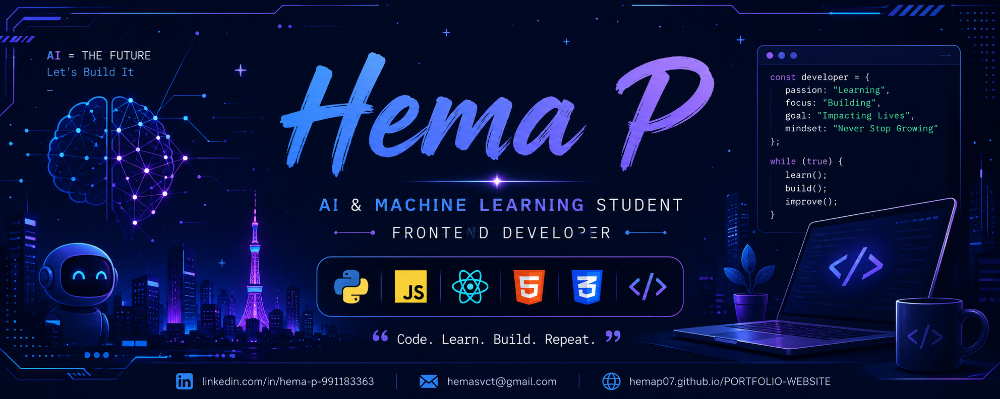

  

<h1 align="center">Hi 👋, I'm Hema P</h1>

<h3 align="center">
Artificial Intelligence & Machine Learning Student • Frontend Developer • UI/UX Enthusiast
</h3>

---

## 🙋‍♀️ About Me

🎓 Computer Science Engineering student specializing in **Artificial Intelligence & Machine Learning** at **Sri Venkateshwaraa College of Technology**.

💻 Passionate about building responsive websites and creating intuitive user experiences.

🌱 Currently learning **React.js** and expanding my full-stack development skills.

🎯 Interested in AI, Web Development, UI/UX, and Cloud Technologies.

📍 Chennai, Tamil Nadu, India

💬 **Fun Fact:**

> *"I likely spend more time reading error messages than actually writing new code."* 😄

---

## 🌐 Connect With Me

---

# 💻 Tech Stack

---

# 🚀 Featured Projects

### 🍰 Dulce Bakery Website

A responsive bakery website with a modern UI and elegant design.

### 🌐 Portfolio Website

My personal portfolio showcasing my skills, projects, and achievements.

🔗 **Live Demo:** https://hemap07.github.io/PORTFOLIO-WEBSITE/

### 🧮 Calculator with Theme Changer

A JavaScript calculator featuring multiple themes and responsive design.

---

# 📊 GitHub Stats

---

# 📈 Most Used Languages

---

# 📈 Contribution Graph

---

# 🛠 Tools

---

# 🌱 Currently Learning

- ⚛ React.js
- 🤖 Machine Learning
- ☁ Azure Cloud
- 🎨 UI/UX Design
- 🌐 Full Stack Development

---

# 🎯 2026 Goals

✅ Become a MERN Stack Developer

✅ Build AI-powered Web Applications

✅ Contribute to Open Source

✅ Complete More Real-world Projects

✅ Land a Software Development Internship

---

# 💙 Quote I Believe In

> **"Every bug is one step closer to becoming a better developer."**

---

---

<h3 align="center">

⭐ Thanks for visiting my profile! ⭐

</h3>

